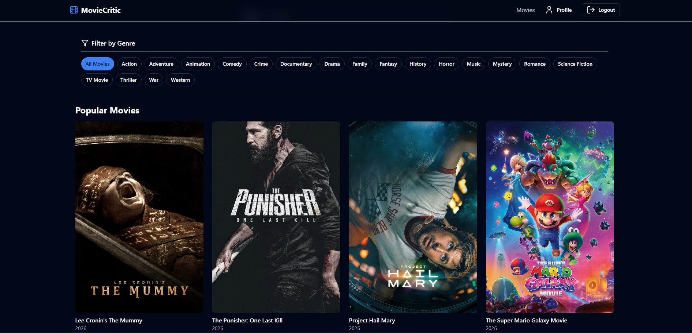
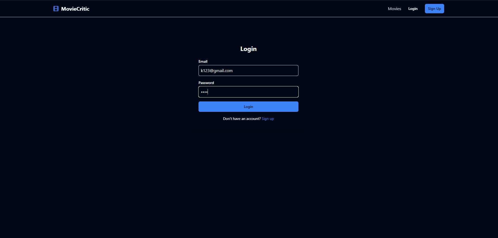
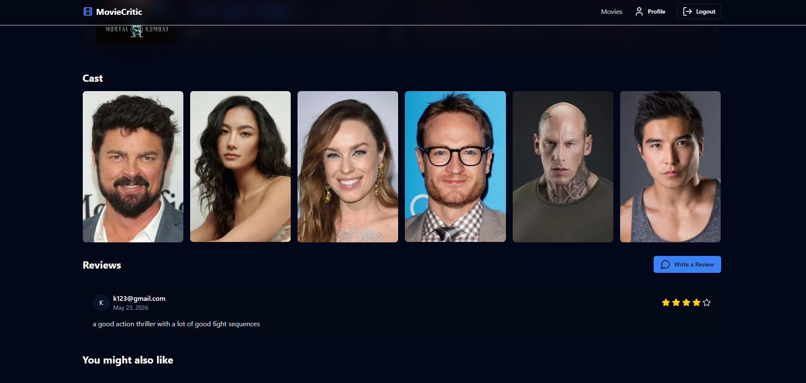
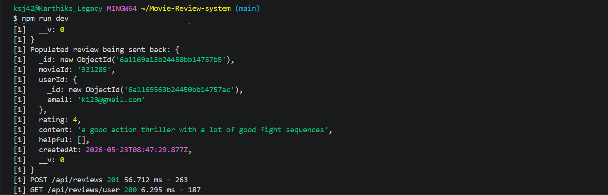

# Movie Review Platform

A full-stack movie review web application where users can browse movies, add reviews, and view ratings. The project is built using the MERN stack with a React frontend, Express/Node.js backend, and MongoDB database.

## Overview

Movie Review Platform is a full-stack web application designed to allow users to interact with movie reviews through a simple and responsive interface. The application supports user authentication, review management, and dynamic rating calculation.

This project helped me understand how frontend, backend, database, authentication, and REST APIs work together in a real-world web application.

## Features

- User authentication with secure password hashing
- Add, view, update, and delete movie reviews
- REST API-based backend architecture
- MongoDB database integration
- Dynamic movie rating calculation
- Responsive React-based user interface
- Toast notifications for user feedback
- Client-side routing using React Router

## Screenshots

### Home Page


### Login Page


### Review Page


### Backend User Creation



 

## Tech Stack

### Frontend
- React.js
- Vite
- Tailwind CSS
- React Router DOM
- Axios
- React Hot Toast
- Lucide React

### Backend
- Node.js
- Express.js
- MongoDB
- Mongoose
- JSON Web Token
- bcryptjs
- dotenv
- CORS
- Morgan

## Project Structure

```text
Movie-Review-system/
│
├── public/              # Static assets
├── src/                 # React frontend source code
├── server/              # Backend server code
│   └── src/             # Express server source files
├── package.json         # Frontend scripts and dependencies
├── vite.config.js       # Vite configuration
├── tailwind.config.js   # Tailwind CSS configuration
└── README.md


